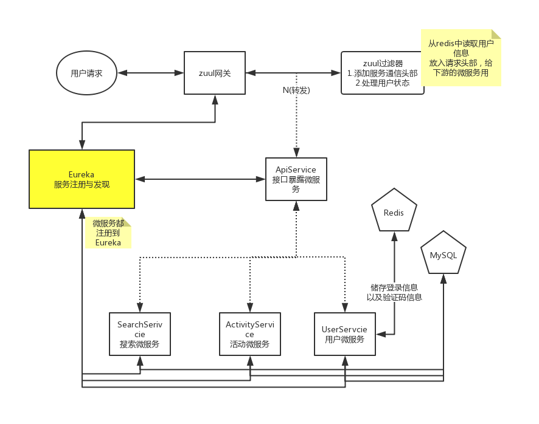

# 原校园蒲行项目

##### 项目展示地址：[点我进入](http://120.78.83.14:8090)    项目后台管理地址：[点我进入](http://120.78.83.14:8090/manage/)  (后台账号test 密码test 【只读权限】)

#### 项目目录：

xypx-cloud：使用Spring Cloud编写的微服务版校园蒲行

xypx-manage： [校园蒲行后台](/xypx-manage)

xypx-normal：[原园蒲行项目(单体版)](/xypx-normal)

xypx-minifilesys：[超简单的图片服务器](/xypx-minifilesys)

前端页面源码仓库：[xypx-front](https://github.com/zxk1997/xypx-front)

#### 项目已使用SpringCloud重写，大致流程图如下

------
#### 技术集成：

- 使用Eureka做注册与发现中心
- 使用Feign实现接口调用微服务
- 使用Zuul做微服务的网关
- 负载均衡Feign和Zuul自带有

#### 一些思考：

登录信息放到redis中，这样所有服务都可以做到无状态，方便机器拓展。

使用zuul来处理用户信息虽然方便下游，但这样会不会给网关带来额外的压力？

因为这项目的特性主要是查询，所以关于活动的查询都放到一个微服务中(SearchService)。

部署时搜索微服务可以多部署几台，但目前所有微服务使用的是同一个数据库，一样会有性能问题。

下一步要做的，在各种查询前加一层本地缓存，以及尝试MySql的读写分离。